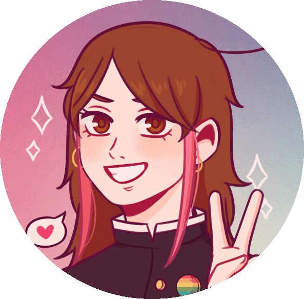
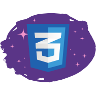
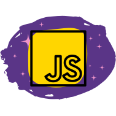
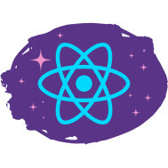
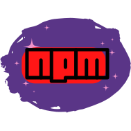
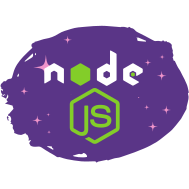
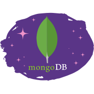
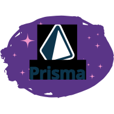
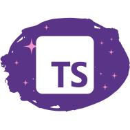

## Oi oi, sou a Luiza! ✌️
Seja muito bem vinda(o) ao meu Perfil! ✨

  

- Pronomes: ela/dela
- Sou Desenvolvedora Web Full-Stack {em desenvolvimento} apaixonada por Tecnologia, faço parte da T4 da Driven Education.
- No momento, estou me aperfeiçoando no mundo front-end, explorando o universo do back-end e aprendendo <strong>Typescript</strong>.
- Uma curiosidade sobre mim: Sou formada em psicologia. 📚

## 📊 Estatísticas

  
  
    

  ## 📫 Contatos

 Se precisar de ajuda ou tiver dúvidas e sugestões, entre em contato comigo 😉 

 
 
 	
   
   

  
 

  

